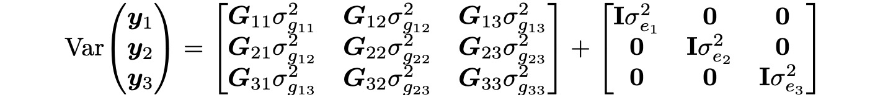
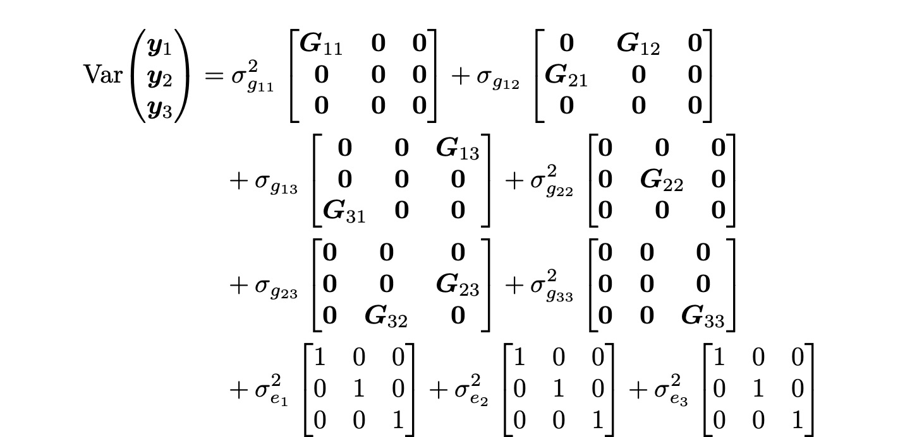

# Genetic Covariance and Variance-Covariance Matrix Estimation for Heterogeneous Stock Rats

This repository provides resources and scripts to estimate genetic covariance and variance-covariance matrices required for the **Genomic SEM R package**. The estimation is performed using **[MPH (Multi-component Penalized Heritability)](https://pmc.ncbi.nlm.nih.gov/articles/PMC11093526/)**, customized specifically for research involving **Heterogeneous Stock (HS) rats**.

### Scope of the Code
This repository is designed for cases where **traits are measured in different cohorts**, rather than in a single cohort with multiple traits. In this context, cohort does not refer to a phenotyping batch. Specifically:
- **Cohorts represent distinct Heterogeneous Stock rats (HS) projects arising from collaborations with the Palmer lab, with each project focusing on a unique set of traits.**
- For example, **Traits A, B, and C are measured in cohorts 1, 2, and 3, respectively.**

The goal is to estimate the genetic covariance matrix between the three traits, accounting for the cohort structure and ensuring accurate variance-covariance modeling.

### Goal of the Analysis

The objective is to compute two key matrices for use in the **Genomic SEM R package**:

1. **Matrix S (Genetic Covariance Matrix):**
   - A symmetric $n \times n$ matrix for $n$ traits.
   - **Diagonal**: Genetic variance for each trait.
   - **Off-diagonal**: Genetic covariances between traits.

2. **Matrix V (Variance-Covariance Matrix of Parameter Estimates):**
   - A symmetric $\frac{n(n+1)}{2} \times \frac{n(n+1)}{2}$ matrix.
   - **Diagonal**: Squared standard errors of genetic variances.
   - **Off-diagonal**: Covariances of standard errors for genetic variances and covariances.

This method overcomes limitations of **LDSC (Linkage Disequilibrium Score Regression)**, which provides out-of-bound estimates for HS rats.

### Correspondence Highlights with the author of MPH, Jicai Jiang

The function for the problem has not been hard-coded in MPH, but MPH does have a flexible (though requiring more data manipulation) approach to doing so. You can stack the phenotypes across cohorts as a single trait. By customizing genomic relationship matrices, the estimation problem for multiple cohorts is reduced to a single-variate multi-component model.

Suppose **G** is a genomic relationship matrix across three cohorts (1-3):

$$
\mathbf{G} =
\begin{pmatrix}
G_{11} & G_{12} & G_{13} \\
G_{21} & G_{22} & G_{23} \\
G_{31} & G_{32} & G_{33}
\end{pmatrix}
$$

Suppose $\mathbf{y}_1, \mathbf{y}_2, \mathbf{y}_3$ are phenotypes for cohorts 1-3. 

$$
\begin{pmatrix} 
\mathbf{y}_1 \\ 
\mathbf{y}_2 \\ 
\mathbf{y}_3 
\end{pmatrix} 
$$

The **variance-covariance matrix** for phenotypes measured across three cohorts is as follows:

- **Matrix on the Left**: Represents genetic variance ($\sigma^2_g$) and genetic covariance between traits across cohorts.
  - **Diagonal elements**: Genetic variance for each cohort.
  - **Off-diagonal elements**: Genetic covariance between cohorts.

- **Matrix on the Right**: Represents residual variance ($\sigma^2_e$).
  - **Diagonal elements**: Residual variance for each cohort.
  - **Off-diagonal elements**: Zero, indicating no residual covariance between cohorts.

This can be expanded as follows:

